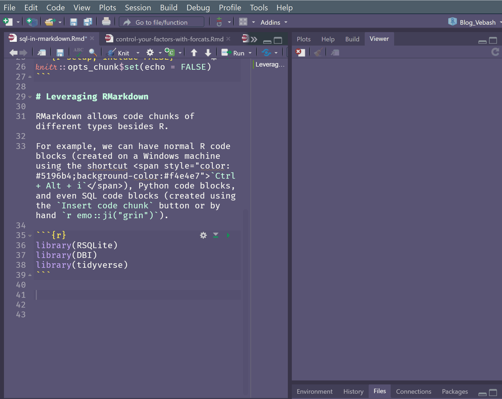

```{r image_grobs, echo = FALSE}
library(cowplot)
library(ggplot2)

p1 <- ggdraw() + draw_image("ttr1.JPG", scale = 1.5, hjust = 0.1)
p2 <- ggdraw() + draw_image("ttr2.JPG", scale = 1.5, hjust = -0.15)

plot_grid(p1, p2, scale = 0.95)

```

<!-- Thumbnail in preview of site by <a href="https://unsplash.com/@balazsbusznyak?utm_source=unsplash&utm_medium=referral&utm_content=creditCopyText">Balazs Busznyak</a> on <a href="https://unsplash.com/s/photos/train?utm_source=unsplash&utm_medium=referral&utm_content=creditCopyText">Unsplash</a> -->
  

```{r setup, include=FALSE}
knitr::opts_chunk$set(echo = TRUE, 
                    warning = FALSE,
                    message = FALSE)
```

# Leveraging RMarkdown

RMarkdown (Rmd) allows code chunks of different language types besides R.

For example, we can have normal R code blocks (created on a Windows machine using the shortcut <span style="color: #5196b4;background-color:#f4e4e7">`Ctrl + Alt + i`</span>), Python code blocks, and even SQL code blocks (created using the <span style="color: #5196b4;background-color:#f4e4e7">`Insert code chunk`</span> button, or by hand `r emo::ji("smile")`).



In this post we're going to write `SQL` syntax and intertwine that with R code to enable you to use both, if you are familiar with both.

We will also look at the <span style="color: #5196b4;background-color:#f4e4e7">`{tidyquery}`</span> package which allows you to learn {dplyr} if you're more familiar with SQL, but keen to grasp more {dplyr}.

## Prerequisites

The blog post assumes that you have at least a beginner understanding of:

1. RMarkdown
1. SQL
1. Tidyverse
1. Connecting to a DB from RStudio (see [Part I](https://sciencificity-blog.netlify.app/posts/2020-12-12-using-the-tidyverse-with-databases/), [Part II](https://sciencificity-blog.netlify.app/posts/2020-12-20-using-the-tidyverse-with-dbs-partii/) or [Part III](https://sciencificity-blog.netlify.app/posts/2020-12-31-using-tidyverse-with-dbs-partiii/) for more info).


## Dataset

In my home, my 6 year old is currently obsessed with [Ticket to Ride Europe](https://www.daysofwonder.com/tickettoride/en/europe/), so I was excited when I saw the [TidyTuesday Transit Costs Project](https://github.com/rfordatascience/tidytuesday/blob/master/data/2021/2021-01-05/readme.md) data `r emo::ji("train")`.

### Glimpse into the Data

To work with a Database in R we need a few packages. There are a few blog posts on this site that contains more info on how this is achieved, for example, [Using the Tidyverse with Databases - Part I](https://sciencificity-blog.netlify.app/posts/2020-12-12-using-the-tidyverse-with-databases/).


```{r}
library(DBI) # main DB interface
library(RSQLite) # To connect to SQLite DB
library(tidyverse) # for dplyr, readr etc.
library(dbplyr) # dplyr backend for DBs
```

```{r}
# read in the TidyTuesday dataset
transit_cost <- readr::read_csv(glue::glue('https://raw.githubusercontent.com/',
'rfordatascience/tidytuesday/master/data/',
'2021/2021-01-05/transit_cost.csv'))
transit_cost %>%
  head(20) %>%
  DT::datatable(list(scrollX = TRUE,
                     pageLength = 5))
```

If we look at the data we see that `Country` is the 2-letter code _CZ, DK, CH_ etc. We can use the <span style="color: #5196b4;background-color:#f4e4e7">`{countrycode}`</span>  package to find the actual country name. 

Let's take a look at a few of the variables included in the `countrycode::codelist` dataframe.

```{r}
library(countrycode)
codelist %>%
  select(country.name.en,
         country.name.en.regex,
         iso.name.en,
         currency,
         iso2c, iso3c)
```

If you try the <span style="color: #5196b4;background-color:#f4e4e7">countrycode::countrycode()</span> function you will get a warning for `UK` in the `transit_cost` dataset. This is because the *United Kingdom* is coded as *GB* not *UK*. So we need to amend our dataset first before we try and use the function.

```{r}
transit_cost %>%
  # rename UK as GB to enable
  # the join later
  mutate(country = if_else(country == "UK",
            "GB",
            country)) %>%
  mutate(country_name = countrycode(country, origin = 'iso2c',
                                    destination = "country.name")) %>%
  count(country, country_name, sort = TRUE) %>%
    DT::datatable(list(scrollX = TRUE,
                     pageLength = 8))
```

Now we can see which country is attached to which `iso2` code, _DK = Denmark_, _CN = China_ etc.

The <span style="color: #5196b4;background-color:#f4e4e7">`codelist`</span> dataframe contains the raw data for countries as we saw previously.

```{r, code_folding = TRUE}
codelist %>% 
  head(4)
```

## Write data to a SQLite DB

We're going to write the `transit_cost` and `codelist` dataframes into tables in a SQLite DB for our demo.

```{r}
# Make a connection to a non-existant
# DB - here the DB `ticket_to_ride` does
# not yet exist.
# This step creates it.
con <- DBI::dbConnect(RSQLite::SQLite(), 
        dbname = "ticket_to_ride.sqlite")
```


```{r}
# Amend UK to GB for the join of country names later
transit_cost <- transit_cost %>%
  mutate(country = if_else(country == "UK",
            "GB",
            country))

# rename to an easy to understand SQL table name
country_codes <- codelist

# Write dataframes into DB tables 
dbWriteTable(con,
    "transit_cost", # table will be named transit_cost
    transit_cost, # df being written
    overwrite = TRUE)
dbWriteTable(con, 
    "country_codes", # table will be named country_codes
    country_codes, # df being written 
    overwrite = TRUE)

# close the connection
dbDisconnect(con)
```

I closed the connection here since the tasks of writing data into a Database, and reading from it, are most likely separate. 

In this blog post these functions run into each other, and we don't strictly need to do this `dbDisconnect(con)` here.

## Connect to the Database

Now that we have a SQLite DB, we can connect to it and query the data we have stored there.

```{r}
# Make a connection
ttr_con <- dbConnect(RSQLite::SQLite(), "ticket_to_ride.sqlite")
# List tables in DB
dbListTables(ttr_con)
```

Ah nice, we see our two tables. Let's have a closer look.

```{r}
# Get a glimpse of the data

# Using our connection reach into the DB
# and show us some of the data for GR

# Equivalent to:
#   SELECT * FROM transit_cost
#   WHERE country = 'GR'
tbl(ttr_con, "transit_cost") %>%
  filter(country == "GR")
```

## Code Chunks

All our code chunks have thus far been <span style="color: #5196b4;background-color:#f4e4e7">`r` code chunks</span>:

````
```{r}`r ''`
# Do some processing
```
````

For example, to filter the Greece transit data in the dataset, we used the code chunk:

````
```{r}`r ''`
# Get a glimpse of the data
tbl(ttr_con, "transit_cost") %>%
  filter(country == "GR")
```
````

### Adding SQL Code chunks

To add a <span style="color: #5196b4;background-color:#f4e4e7">`SQL`</span> code chunk we can use the <span style="color: #5196b4;background-color:#f4e4e7">`Insert a new code chunk`</span> drop down item. But a SQL code chunk also needs one additional argument - the <span style="color: #5196b4;background-color:#f4e4e7">connection</span> object which represents the connection to the database.

````
```{sql, connection = con}`r ''`
# Do some processing
```
````

Let's try it.

````
```{sql, connection = ttr_con} `r ''`
-- This is a SQL comment
-- Notice our connection is the ttr_con we established
-- in the {r} code chunk earlier.

SELECT * 
FROM transit_cost
WHERE country = 'GR'
LIMIT 10
```
````

There is even <span style="color: #7A4988;background-color:white">syntax highlighting</span> in the `{sql, connection = ttr_con}` code blocks.


```{sql, connection = ttr_con, code_folding = TRUE}
-- This is a SQL comment
-- Notice our connection is the ttr_con we established
-- in the {r} code chunk earlier.

SELECT * 
FROM transit_cost
WHERE country = 'GR'
LIMIT 10
```

- The `connection` is the one we established earlier, in an `{r}` code chunk, shown again below.

    ````
    ```{r}  `r ''`
    # Make a connection
    ttr_con <- dbConnect(RSQLite::SQLite(), "ticket_to_ride.sqlite")
    # List tables in DB
    dbListTables(ttr_con)
    ```
    ````

- The `SQL` code chunk uses a different character for comments. The <span style="color: #5196b4;background-color:#f4e4e7">`--`</span> (double dashes) is a `SQL` comment marker, whereas the `#` (hash / pound symbol / octothorpe) is used for `R` and `Python` comments.

    ````
    ```{sql, connection = ttr_con} `r ''`
    -- This is a SQL comment
    -- Notice our connection is the ttr_con we established
    -- in the {r} code chunk earlier.
    
    -- Do some processing ...
    
    ```
    ````

### Using Your SQL Knowledge

Let's use SQL to get a few columns of the `transit_cost` table for `Denmark` (DK) and `Turkey` (TR). My kid's favourite route in *Ticket to Ride* is Kobenhavn-Erzurum so he can use the high scoring tunnel, which gets him 21 points `r emo::ji("hooray")`!

````
```{sql, connection = ttr_con} `r ''`
SELECT country
, city
, start_year
, end_year
, cost_km_millions
, AVG(cost_km_millions) OVER (PARTITION BY country) AS avg_cost_km
, MAX(cost_km_millions) OVER (PARTITION BY country) AS max_cost_km
FROM transit_cost
WHERE country IN ('DK', 'TR')
ORDER BY country, start_year
```
````

```{sql, connection = ttr_con, code_folding = TRUE}
SELECT country
, city
, start_year
, end_year
, cost_km_millions
, AVG(cost_km_millions) OVER (PARTITION BY country) AS avg_cost_km
, MAX(cost_km_millions) OVER (PARTITION BY country) AS max_cost_km
FROM transit_cost
WHERE country IN ('DK', 'TR')
ORDER BY start_year, country
```

### Passing data between code blocks

We can also pass data between code blocks by using the <span style="color: #5196b4;background-color:#f4e4e7">`ouput.var`</span> variable in a code block.

For example, below we use a SQL query (in a `{sql, connection = ttr_con}` code block) but the result is stored in a variable which is subsequently used in an `{r}` code chunk. How cool is that! `r emo::ji("cool")` `r emo::ji("flex")`

````
```{sql, connection = ttr_con,  output.var = "transit_subset"} `r ''`
-- output stored in transit_subset
SELECT country
, city
, start_year
, end_year
, cost_km_millions
FROM transit_cost
```
````

```{sql, connection = ttr_con, code_folding = TRUE, output.var = "transit_subset"}
-- output stored in transit_subset
SELECT country
, city
, start_year
, end_year
, cost_km_millions
FROM transit_cost
```

When we store the data in a variable the SQL query is executed on the DB and the output stored in the variable. As a result we don't see the results of the query as output from the code chunk, as we have seen previously.

Now let's use the `transit_subset` variable in an `{r}` code chunk, to see how many transit lines the country has.

````
```{r} `r ''`
transit_subset %>% 
  count(country, sort = TRUE) %>%
    DT::datatable(list(scrollX = TRUE,
                     pageLength = 8))
```
````

```{r, code_folding = TRUE}
transit_subset %>% 
  count(country, sort = TRUE) %>%
    DT::datatable(list(scrollX = TRUE,
                     pageLength = 8))
```

How about if we want to use `{dplyr}` to get the average cost per km in millions of dollars, for Denmark and Turkey as we did in the SQL code previously?

````
```{r} `r ''`
transit_subset %>% 
  filter(country %in% c('DK', 'TR')) %>% 
  group_by(country) %>% 
  mutate(avg_cost_km = mean(cost_km_millions, na.rm = TRUE)) %>% 
  ungroup()
```
````

```{r, code_folding = TRUE}
transit_subset %>% 
  filter(country %in% c('DK', 'TR')) %>% 
  group_by(country) %>% 
  mutate(avg_cost_km = mean(cost_km_millions, na.rm = TRUE)) %>% 
  ungroup()
```

Or what if we wanted to make a plot of the costs over time, for a few select countries.

````
```{r} `r ''`
transit_subset %>% 
  filter(country %in% c('IN', 'TR'),
         !is.na(start_year)) %>% 
  ggplot(aes(start_year, 
             cost_km_millions, 
             fill = country)) +
  geom_col() +
  theme_light() +
  theme(axis.text.x = element_text(angle = 45,
                                   hjust = 1)) +
  labs(x = "", 
       y = "Cost per km ($millions)",
       title = "Cost per km over the years for India and Turkey")
```
````

```{r, code_folding = TRUE}
transit_subset %>% 
  filter(country %in% c('IN', 'TR'),
         !is.na(start_year)) %>% 
  ggplot(aes(start_year, 
             cost_km_millions, 
             fill = country)) +
  geom_col() +
  theme_light() +
  theme(axis.text.x = element_text(angle = 45,
                                   hjust = 1)) +
  labs(x = "", 
       y = "Cost per km ($millions)",
       title = "Cost per km over the years for India and Turkey")
```

It's really empowering to flex both our R and SQL skills!

We are able to write quite complex SQL code in the `{sql connection = ttr_con}` code blocks, including joins, window functions etc.

Here's an example of a join in order to get the country name:

````
```{sql, connection = ttr_con} `r ''`
SELECT t.country AS country_code
, "country.name.en" AS country
, t.city
, t.currency
, t.start_year
, t.end_year
, t.cost_km_millions
FROM transit_cost t
INNER JOIN country_codes c
ON t.country = c.iso2c
LIMIT 10
```

````

```{sql, connection = ttr_con, code_folding = TRUE}
SELECT t.country AS country_code
, "country.name.en" AS country
, t.city
, t.currency
, t.start_year
, t.end_year
, t.cost_km_millions
FROM transit_cost t
INNER JOIN country_codes c
ON t.country = c.iso2c
LIMIT 10
```


### Cleaning Up

Finally we need to disconnect from the database, which we do in an `{r}` code chunk.

````
```{r} `r ''`
dbDisconnect(con)
```
````

```{r, code_folding = TRUE}
dbDisconnect(con)
```


## The {tidyquery} package

We can use a nifty package called <span style="color: #5196b4;background-color:#f4e4e7">`{tidyquery}`</span> to query a dataframe as though it is a SQL table, with some [limitations](https://github.com/ianmcook/tidyquery) (for example, `OVER` clauses are not yet supported).

For the rest of the post the code that is in `{r}` code chunks.

### tidyquery::query()

First up is the <span style="color: #5196b4;background-color:#f4e4e7">`query("SELECT * FROM df_name")`</span>.

The function allows you to write `SQL` statements on an R data frame.

- <span style="color: #5196b4;background-color:#f4e4e7">`"SELECT * FROM"`</span>  is the familiar SQL syntax.
- <span style="color: #5196b4;background-color:#f4e4e7">`df_name`</span> is the data frame name in your code (we will use the `transit_cost` and `country_codes` data frames).
- Note: We called our tables in the DB by the same names, but we have closed the connection to the DB in the section prior to this.

```{r}
library(tidyquery)
# We have a df that is transit_cost in our environment
class(transit_cost)
glimpse(transit_cost)
class(country_codes)
```

Alright let's see the `query()` function in action.

```{r}
query(
  "SELECT country
    , city
    , start_year
    , end_year
    , cost_km_millions
    FROM transit_cost
    WHERE country IN ('DK', 'TR')
    ORDER BY start_year, country ;
  "
)
```

We get the results of our query on a data frame! `r emo::ji("wow")` `r emo::ji("munch")` 

### tidyquery::show_dplyr()

The package also has a <span style="color: #5196b4;background-color:#f4e4e7">`show_dplyr()`</span> function to let you see how to use {dplyr} verbs to get equivalent output as your SQL query `r emo::ji("exclamation")` `r emo::ji("stars")`.

- Call <span style="color: #5196b4;background-color:#f4e4e7">`show_dplyr()`</span>
- Pass in a SQL query in `""` as an argument.

```{r}
show_dplyr(
    "SELECT country
    , city
    , start_year
    , end_year
    , cost_km_millions
    FROM transit_cost
    WHERE country IN ('DK', 'TR')
    ORDER BY start_year, country ;
  "
)
```

We get the {dplyr} pipeline!


### Toggle to {dplyr} from SQL

Copying and pasting this {dplyr} pipeline into an `{r}` code chunk results in the same output! Nice, eh? `r emo::ji("tada")`

```{r}
transit_cost %>%
  filter(country %in% c("DK", "TR")) %>%
  select(country, city, start_year, end_year, cost_km_millions) %>%
  arrange(start_year, country)
```

{tidyquery} can also do more complex querying.

```{r}
query(
  'SELECT t.country AS country_code
  , country.name.en AS country_name
  , COUNT(city) AS num_lines
  FROM transit_cost t
  INNER JOIN country_codes c
  ON t.country = c.iso2c
  GROUP BY t.country, country.name.en
  HAVING num_lines >= 10
  ORDER BY num_lines DESC
  LIMIT 15
  '
)
```

```{r}
show_dplyr(
  'SELECT t.country AS country_code
  , country.name.en AS country_name
  , COUNT(city) AS num_lines
  FROM transit_cost t
  INNER JOIN country_codes c
  ON t.country = c.iso2c
  GROUP BY t.country, country.name.en
  HAVING num_lines >= 10
  ORDER BY num_lines DESC
  LIMIT 15
  '
)
```


Copying and pasting the {dplyr} code produced here also works like the bomb! `r emo::ji("bomb")`

```{r}
transit_cost %>%
  inner_join(country_codes, by = c(country = "iso2c"), suffix = c(".t", ".c"), na_matches = "never") %>%
  rename(t.currency = "currency.t", c.currency = "currency.c") %>%
  group_by(country, country.name.en) %>%
  filter(sum(!is.na(city)) >= 10) %>%
  summarise(sum(!is.na(city))) %>%
  ungroup() %>%
  mutate(country_code = country, country_name = country.name.en, num_lines = `sum(!is.na(city))`) %>%
  arrange(dplyr::desc(num_lines)) %>%
  select(country_code, country_name, num_lines) %>%
  head(15)
```

While {tidyquery} has some limitations this is a cool way to learn {dplyr} if you're familiar with `SQL`.

## Packages used

In this post the main packages we used are the following:

```{r, eval = FALSE}
library(DBI)
library(RSQLite)
library(dplyr)
library(dbplyr)
library(ggplot2)
library(readr)
library(countrycode)
library(tidyquery)
```

## Resources

1. If you'd like to see the code for this post, you may find it [here](https://github.com/sciencificity/sql-in-rmd).
1. Ian Cook's talk ["Bridging the Gap between SQL and R"](https://www.rstudio.com/resources/rstudioconf-2020/bridging-the-gap-between-sql-and-r/).

Thanks for reading!


