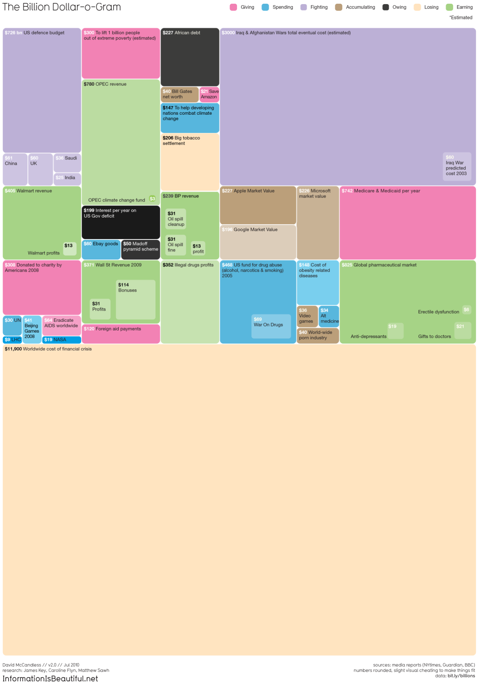

```{=html}
<!-- Photo by <a href="https://unsplash.com/@fabioha?utm_source=unsplash&utm_medium=referral&utm_content=creditCopyText">fabio</a> on <a href="https://unsplash.com/s/photos/tree-map?utm_source=unsplash&utm_medium=referral&utm_content=creditCopyText">Unsplash</a> 
Photo by <a href="https://unsplash.com/@arditoryan?utm_source=unsplash&utm_medium=referral&utm_content=creditCopyText">ardito ryan Harrisna</a> on <a href="https://unsplash.com/s/photos/tree-map?utm_source=unsplash&utm_medium=referral&utm_content=creditCopyText">Unsplash</a>
Photo by <a href="https://unsplash.com/@joshstyle?utm_source=unsplash&utm_medium=referral&utm_content=creditCopyText">JOSHUA COLEMAN</a> on <a href="https://unsplash.com/s/photos/tree-map?utm_source=unsplash&utm_medium=referral&utm_content=creditCopyText">Unsplash</a>
    
-->
```


Visual from <a href="https://informationisbeautiful.net">Information is Beautiful</a> where the viz was a treemap <a href="https://informationisbeautiful.net/visualizations/the-billion-dollar-o-gram-2009/">featuring rectangles showing differences between different big numbers</a>

```{r setup, include=FALSE}
knitr::opts_chunk$set(echo = TRUE, 
                    warning = FALSE,
                    message = FALSE)
```

# Treemap Visualisations

[Treemaps](https://en.wikipedia.org/wiki/Treemapping) are great for hierarchical data visualisation. I was inspired by the informative and beautiful [The Billion Dollar-o-Gram 2009](https://informationisbeautiful.net/2010/the-billion-dollar-o-gram-2009/) treemap at *Information is Beautiful*.

```{r load-libs}
library(tidyverse)
library(treemap)
# install.packages("devtools")
# devtools::install_github("timelyportfolio/d3treeR")
library(d3treeR)
```

## Read in data

The data comes from the [TidyTuesday Project](https://github.com/rfordatascience/tidytuesday) in particular [Week 11 of 2021](https://github.com/rfordatascience/tidytuesday/blob/master/data/2021/2021-03-09/readme.md).

It is data about the [Bechdel Test]{style="color: #5196b4;background-color:#f4e4e7"}. As per the [TidyTuesday Readme](https://github.com/rfordatascience/tidytuesday/blob/master/data/2021/2021-03-09/readme.md) these are the criteria needed to pass the test:

-   there are at least two named women in the picture,
-   they have a conversation with each other at some point,
-   and that conversation isn't about a male character

```{r read-data, cache=TRUE}
raw_bechdel <- readr::read_csv(glue::glue('https://raw.githubusercontent.com',
                                          '/rfordatascience/tidytuesday/master/data',
                                          '/2021/2021-03-09/raw_bechdel.csv'))
movies <- readr::read_csv(glue::glue('https://raw.githubusercontent.com',
                                     '/rfordatascience/tidytuesday/master/data',
                                     '/2021/2021-03-09/movies.csv'))
```

## EDA

Let's get a feel for the data we're working with.

```{r view-data}
# output reproducible
set.seed(2187)

movie_sample <- movies %>% 
  slice_sample(n = 10)

movie_sample %>% 
  DT::datatable(filter = 'top', list(scrollX = TRUE,
                     pageLength = 5),
    caption = htmltools::tags$caption(
      style = 'caption-side: bottom; text-align: center;',
     'Table Name: ', htmltools::em('Movie Data')
  ))

raw_bechdel %>% 
  filter(imdb_id %in% c(movie_sample %>% pull(imdb_id))) %>% 
  DT::datatable(filter = 'top', list(scrollX = TRUE,
                     pageLength = 5),
    caption = htmltools::tags$caption(
      style = 'caption-side: bottom; text-align: center;',
     'Table Name: ', htmltools::em('Bechdel Data')
  ))
```

```{r view-data2}
movies %>% 
  count(clean_test, binary, sort=TRUE) %>% 
  gt::gt()

movies %>% 
  count(genre, binary, clean_test) %>% 
  DT::datatable(filter = 'top', list(scrollX = TRUE,
                     pageLength = 5),
    caption = htmltools::tags$caption(
      style = 'caption-side: bottom; text-align: center;',
     'Table Name: ', htmltools::em('Test criteria for pass/fail')
  ))

raw_bechdel %>% 
  count(rating) %>% 
  gt::gt()

movies %>% 
  inner_join(raw_bechdel, by = "imdb_id") %>% 
  select(imdb_id, "title" = "title.x",
         "year" = "year.x", 
         country, genre, rating) %>% 
  distinct() %>% 
  drop_na() %>%
  slice_sample(n = 50) %>% 
  DT::datatable(filter = 'top', list(scrollX = TRUE,
                     pageLength = 5),
    caption = htmltools::tags$caption(
      style = 'caption-side: bottom; text-align: center;',
     'Table Name: ', htmltools::em('Ratings for movies')
  ))
```

## Treemap

For a treemap you need to provide:

1.  [`dtf`]{style="color: #5196b4;background-color:#f4e4e7"} : A dataset

2.  [`index`]{style="color: #5196b4;background-color:#f4e4e7"} : The column(s) in your dataset that represents your group(s).

    -   Specifying one column = simple treemap with no hierarchy
    -   Specifying more than one column = a treemap with hierachy (first column = level 1, second column = second level etc.)
    -   ?treemap for more information

3.  [`vSize`]{style="color: #5196b4;background-color:#f4e4e7"} : The column(s) that represent the size of each of the group(s).

### Simple treemap

Perhaps we're interested in seeing how many films in each genre are represented. Each movie may be categorised as multiple genres so let's make each genre a separate row (tip from David Robinson's [screencasts](https://www.youtube.com/channel/UCeiiqmVK07qhY-wvg3IZiZQ)). For example, the movie *The Reader* is listed as `Drama, Romance` so it will have a separate row after this with each genre (two rows now instead of one).

```{r simple}
movies %>% 
  # split each into a separate row with each genre listed separately
  # creates multiple rows for a movie broken down by each genre it
  # belongs to.
  separate_rows(genre, sep = ",") %>% 
  mutate(genre = str_squish(genre)) %>%
  filter(!is.na(genre)) %>% 
  count(genre, sort = TRUE) %>% 
  DT::datatable(filter = 'top', list(scrollX = TRUE,
                     pageLength = 8),
    caption = htmltools::tags$caption(
      style = 'caption-side: bottom; text-align: center;',
     'Table Name: ', htmltools::em('Number of movies per Genre')
  ))

movies %>% 
  # split each into a separate row with each genre listed separately
  # creates multiple rows for a movie broken down by each genre it
  # belongs to. 
  separate_rows(genre, sep = ",") %>% 
  mutate(genre = str_squish(genre)) %>% 
  filter(!is.na(genre)) %>% 
  count(genre) %>% 
  treemap(
    # simple treemap with one group
    index = "genre",
    # size of rect = number of movies in each category
    vSize = "n",
    type = "index",
    # make size of title and labels larger
    fontsize.title = 30,
    # specify size of labels in order of group, sub group etc.
    fontsize.labels = c(24)
  )

```

That's nice, clean and pretty! But we can also change the title etc. to make it more appealing.

### Treemap with some hierarchy

Let's say we just want to see the genre by pass and fail. To achieve this we make our index have the two groups we're interested in seeing. In the below it is the:

  <span style="color: #5196b4;background-color:#f4e4e7">`index = c("genre", "binary")`</span> 

which specifies that we'd like to see each rectangle first represent a genre and then represent whether it passed or failed the Bechdel test.

```{r hierarchy}
# package to allow me to add the font I want to use
library(showtext)
font_add(family = "segoeui", regular = r"(C:\WindowsFonts\segoeui.ttf)")
showtext_auto()

# install palettes
# devtools::install_github("sciencificity/werpals")
# I am using a palette I created
palette_prov <-  werpals::nature_palettes[["provence"]]

movies %>% 
  separate_rows(genre, sep = ",") %>% 
  mutate(genre = str_squish(genre)) %>%
  filter(!is.na(genre)) %>% 
  count(genre, binary, sort = TRUE) %>% 
  DT::datatable(filter = 'top', list(scrollX = TRUE,
                     pageLength = 5),
    caption = htmltools::tags$caption(
      style = 'caption-side: bottom; text-align: center;',
     'Table Name: ', htmltools::em('Number of Pass / Fail per Genre')
  ))

movies %>% 
  separate_rows(genre, sep = ",") %>% 
  mutate(genre = str_squish(genre)) %>% 
  filter(!is.na(genre)) %>% 
  count(genre, binary) %>% 
  treemap(
    # treemap with a level of hierarchy
    index = c("genre", "binary"),
    vSize = "n",
    type = "index",
    title = "Number of Pass vs Fail of Bechdel test in each Genre",
    fontsize.title = 30,
    # specify size of labels in order of group, sub group etc.
    fontsize.labels = c(24, 20), 
    # what font to use
    fontfamily.title = "segeoui",
    fontfamily.labels = "segeoui",
    # align the labels again in order
    align.labels=list(
        # group 1
        c("center", "top"),
        # sub group 1
        c("center", "center")
    ),
    lowerbound.cex.labels = 0.5, # multiplier for when labels drawn
    palette = palette_prov
  )

```


### Make it interactive with {d3treeR}

Let's have a look at the gross income

| Name of Field | Type      | Description                            |
|---------------|-----------|----------------------------------------|
| intgross_2013 | character | International gross normalized to 2013 |


```{r interact}
movies_summ <- 
  # setup our dataset for the treemap
  movies %>%
  # it is a character field so let's convert it
  mutate(intgross_2013 = parse_number(intgross_2013)) %>% 
  separate_rows(genre, sep = ",") %>% 
  mutate(genre = str_squish(genre)) %>%
  filter(!is.na(genre)) %>% 
  group_by(genre, binary) %>% 
  # add median gross income normalised to 2013 year
  # make it millions
  mutate(median_inc = round(median(intgross_2013, na.rm = TRUE)/1e6),2) %>% 
  ungroup() %>% 
  count(genre, binary, median_inc) 

movies_summ %>% 
  DT::datatable(filter = 'top', list(scrollX = TRUE,
                     pageLength = 5),
    caption = htmltools::tags$caption(
      style = 'caption-side: bottom; text-align: center;',
     'Table Name: ', htmltools::em('Median Income for each Genre based on whether the movie passed / failed the test')
  ))

movie_summ_map <- movies_summ %>% 
  treemap(
    # treemap with a level of hierarchy
    index = c("genre", "median_inc", "binary"),
    vSize = "median_inc",
    type = "index",
    title = "Income of each Genre based on whether the movie passed / failed test",
    fontsize.title = 26,
    # specify size of labels in order of group, sub group etc.
    fontsize.labels = c(24, 0, 20), 
    # what font to use
    fontfamily.title = "segeoui",
    fontfamily.labels = "segeoui",
    # align the labels again in order
    align.labels=list(
        # group 1
        c("center", "top"),
        # sub group 1 - we're not showing this though
        c("center", "bottom"),
        # sub group 2
        c("center", "center")
    ),
    palette = "Set3",
    lowerbound.cex.labels = 0.5, # multiplier for when labels drawn
    force.print.labels = FALSE,
  )
```

On the viz below you can click on a block to enter it. Click again to exit.

```{r interact2}
# Make it interactive
d3tree(movie_summ_map, rootname = "Revenue per Genre per Pass/Fail Bechdel")
```

The movies that fail the test seem to have a higher revenue than those that pass.

#### Want to save the visual?

You can save the widget using the code below (courtesy of [R Graph Gallery](https://www.r-graph-gallery.com/237-interactive-treemap.html)).

```{r interactwidget, eval = FALSE}
# save the widget
library(htmlwidgets)
saveWidget(movie_summ_map, file=paste0(here::here("HtmlWidget"),
                                "interactiveTreemap-bechdel.html"))
```


## Resources

1. [The R Graph Gallery](https://www.r-graph-gallery.com/treemap.html)
1. [Building Widgets](http://www.buildingwidgets.com/blog/2015/7/22/week-29-d3treer-v2)
1. Jon Schwabish's _One Chart at a Time_ on [Treemap](https://www.youtube.com/watch?v=YB3STsvTJiA)
