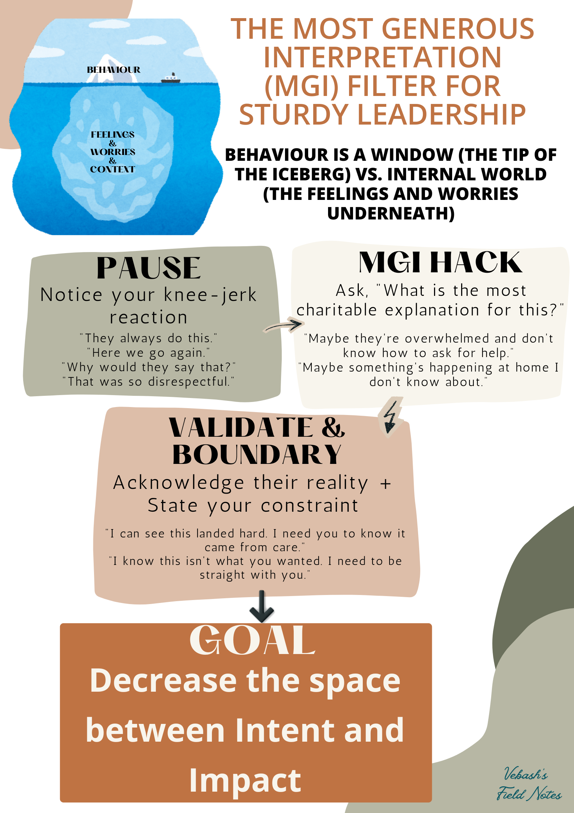

```{r setup, include=FALSE}
knitr::opts_chunk$set(echo = FALSE)
```

<!-- Photo by <a href="https://unsplash.com/@stephaniemoarr?utm_source=unsplash&utm_medium=referral&utm_content=creditCopyText">Stephanie Morales</a> on <a href="https://unsplash.com/photos/person-holding-white-ceramic-mug-DGt9zA3Fr0g?utm_source=unsplash&utm_medium=referral&utm_content=creditCopyText">Unsplash</a> -->


```{css, echo = FALSE, code_folding = FALSE}
blockquote {
  background: #f9f9f9;
  border-left: 10px solid #ccc;
  margin: 1.5em 10px;
  padding: 0.5em 10px;
  quotes: "\201C""\201D""\2018""\2019";
}
blockquote:before {
  color: #ccc;
  content: open-quote;
  font-size: 4em;
  line-height: 0.1em;
  margin-right: 0.25em;
  vertical-align: -0.4em;
}
blockquote p {
  display: inline;
}
```

<figure class="quote">
  <blockquote>
    Finding the good inside can often come from asking ourselves one simple question: “What is my most generous interpretation of what just happened? 
  </blockquote>
  <figcaption>
    &mdash; Dr Becky Kennedy </figcaption>
</figure>

<!--  -->

      

𝖨'𝗏𝖾 𝖻𝖾𝖾𝗇 𝗍𝗈𝗅𝖽 𝖨'𝗆 "𝗌𝗈𝖿𝗍" 𝗆𝗈𝗋𝖾 𝗍𝗂𝗆𝖾𝗌 𝗍𝗁𝖺𝗇 𝖨 𝖼𝖺𝗇 𝖼𝗈𝗎𝗇𝗍. 𝖴𝗌𝗎𝖺𝗅𝗅𝗒 𝗌𝖺𝗂𝖽 𝗅𝗂𝗄𝖾 𝗂𝗍'𝗌 𝖺 𝗐𝖾𝖺𝗄𝗇𝖾𝗌𝗌. 𝖡𝗎𝗍 𝗁𝖾𝗋𝖾'𝗌 𝗐𝗁𝖺𝗍 𝖨'𝗏𝖾 𝗋𝖾𝖺𝗅𝗂𝗌𝖾𝖽 ... 𝖨 𝗐𝖺𝗌𝗇'𝗍 𝖻𝖾𝗂𝗇𝗀 𝗌𝗈𝖿𝗍. 𝖨 𝗐𝖺𝗌 𝖽𝗈𝗂𝗇𝗀 𝗌𝗈𝗆𝖾𝗍𝗁𝗂𝗇𝗀 𝖨 𝖽𝗂𝖽𝗇'𝗍 𝗒𝖾𝗍 𝗁𝖺𝗏𝖾 𝗍𝗁𝖾 𝗏𝗈𝖼𝖺𝖻𝗎𝗅𝖺𝗋𝗒 𝖿𝗈𝗋. 𝖨 𝗐𝖺𝗌 𝖼𝗁𝗈𝗈𝗌𝗂𝗇𝗀 𝗍𝗈 𝗅𝗈𝗈𝗄 𝖻𝖾𝗇𝖾𝖺𝗍𝗁 𝗍𝗁𝖾 𝖻𝖾𝗁𝖺𝗏𝗂𝗈𝗎𝗋 𝖻𝖾𝖿𝗈𝗋𝖾 𝖨 𝗋𝖾𝖺𝖼𝗍𝖾𝖽. That's not weakness. That's actually one of the harder things to do consistently, especially under pressure.

𝖸𝗈𝗎 𝗄𝗇𝗈𝗐 𝗍𝗁𝖺𝗍 𝗌𝗎𝖻𝗋𝖾𝖽𝖽𝗂𝗍 "𝖠𝗆 𝖨 𝗍𝗁𝖾 𝖩𝖾𝗋𝗄?" (𝗍𝗁𝖾 𝖺𝖼𝗍𝗎𝖺𝗅 𝗇𝖺𝗆𝖾 𝗂𝗌 𝖺 𝗅𝖾𝗌𝗌 𝗉𝗈𝗅𝗂𝗍𝖾 - 𝖠𝖨𝖳𝖠 😅)? 𝖳𝗁𝖾 𝗈𝗉𝗍𝗂𝗈𝗇𝗌 𝖺𝗋𝖾 𝗌𝗈𝗆𝖾𝗍𝗁𝗂𝗇𝗀 𝗅𝗂𝗄𝖾: 

- Yes, you're the jerk
- Not the jerk
- No one's the jerk
- Both of you are jerks
- Not enough info

I 𝗄𝗂𝗇𝖽𝖺 𝗋𝗎𝗇 𝗍𝗁𝖺𝗍 𝗉𝗈𝗅𝗅 𝗂𝗇 𝗆𝗒 𝗁𝖾𝖺𝖽, 𝗐𝗁𝖾𝗇 𝗌𝗈𝗆𝖾𝗈𝗇𝖾 𝗌𝖺𝗒𝗌 𝗈𝗋 𝗐𝗋𝗂𝗍𝖾𝗌 𝗌𝗈𝗆𝖾𝗍𝗁𝗂𝗇𝗀 𝗍𝗁𝖺𝗍 𝗆𝖺𝗄𝖾𝗌 𝗆𝖾 𝖿𝖾𝖾𝗅 𝗇𝗈𝗍 𝗌𝗈 𝗅𝖾𝗄𝗄𝖾𝗋 𝖿𝗈𝗋 𝖾.𝗀., 𝖲𝗈𝗆𝖾𝗈𝗇𝖾 𝗌𝖾𝗇𝖽𝗌 𝖺 𝗁𝖺𝗋𝗌𝗁 𝗆𝖾𝗌𝗌𝖺𝗀𝖾. A team member misses a deadline again. A colleague cuts you off mid-sentence. **𝗧𝗵𝗲 𝗶𝗻𝘁𝗲𝗿𝗻𝗮𝗹 𝗷𝘂𝗿𝘆 𝘂𝘀𝘂𝗮𝗹𝗹𝘆 𝗰𝗼𝗻𝘃𝗲𝗻𝗲𝘀 𝗶𝗺𝗺𝗲𝗱𝗶𝗮𝘁𝗲𝗹𝘆.**

𝖧𝖾𝗋𝖾'𝗌 𝗐𝗁𝖺𝗍 𝖨 𝗁𝖺𝗏𝖾 𝗅𝖾𝖺𝗋𝗇𝗍 (from the people in the 𝖼𝗋𝖾𝖽𝗂𝗍𝗌): 𝖡𝖾𝗁𝖺𝗏𝗂𝗈𝗎𝗋 𝗂𝗌 𝗃𝗎𝗌𝗍 𝗍𝗁𝖾 𝗍𝗂𝗉 𝗈𝖿 𝗍𝗁𝖾 𝗂𝖼𝖾𝖻𝖾𝗋𝗀. 𝖶𝗁𝖺𝗍'𝗌 𝗎𝗇𝖽𝖾𝗋𝗇𝖾𝖺𝗍𝗁: 𝗍𝗁𝖾 𝖿𝖾𝖾𝗅𝗂𝗇𝗀𝗌, the worries, 𝗍𝗁𝖾 𝖼𝗈𝗇𝗍𝖾𝗑𝗍 𝗒𝗈𝗎 𝖼𝖺𝗇'𝗍 𝗌𝖾𝖾, 𝗍𝗁𝖺𝗍'𝗌 𝗍𝗁𝖾 𝗋𝖾𝖺𝗅𝗂𝗍𝗒. 𝖣𝗋 𝖡𝖾𝖼𝗄𝗒 𝖪𝖾𝗇𝗇𝖾𝖽𝗒 𝖼𝖺𝗅𝗅𝗌 𝗍𝗁𝗂𝗌 𝗍𝗁𝖾 **𝗠𝗼𝘀𝘁 𝗚𝗲𝗻𝗲𝗿𝗼𝘂𝘀 𝗜𝗻𝘁𝗲𝗿𝗽𝗿𝗲𝘁𝗮𝘁𝗶𝗼𝗻 (𝗠𝗚𝗜)**, 𝖺𝗇𝖽 𝖨 𝖼𝖺𝗇'𝗍 𝗉𝗁𝗋𝖺𝗌𝖾 𝗂𝗍 𝖻𝖾𝗍𝗍𝖾𝗋 𝗍𝗁𝖺𝗇 𝗌𝗁𝖾 𝖽𝗈𝖾𝗌. 𝖨𝗇 𝖺 𝗌𝗂𝗆𝗂𝗅𝖺𝗋 𝗏𝖾𝗂𝗇, 𝖶𝗂𝗅𝗅 𝖦𝗎𝗂𝖽𝖺𝗋𝖺 𝖺𝗇𝖽 𝖣𝖺𝗇𝗇𝗒 𝖬𝖾𝗒𝖾𝗋 𝖼𝖺𝗅𝗅 𝗂𝗍 𝗍𝗁𝖾 **"𝗰𝗵𝗮𝗿𝗶𝘁𝗮𝗯𝗹𝗲 𝗮𝘀𝘀𝘂𝗺𝗽𝘁𝗶𝗼𝗻"**, 𝖺𝗇𝖽 𝖶𝖾𝗌 𝖪𝖺𝗈 𝗅𝖾𝖺𝗇𝗌 𝗂𝗇𝗍𝗈 **𝘀𝘁𝗿𝗮𝘁𝗲𝗴𝘆 𝘃𝘀 𝘀𝗲𝗹𝗳-𝗲𝘅𝗽𝗿𝗲𝘀𝘀𝗶𝗼𝗻**. 𝖨𝗍'𝗌 𝗂𝗇 𝖾𝗌𝗌𝖾𝗇𝖼𝖾 𝗍𝗁𝖾 𝗉𝗋𝖺𝖼𝗍𝗂𝖼𝖾 𝗈𝖿 𝗉𝗎𝗍𝗍𝗂𝗇𝗀 𝗒𝗈𝗎𝗋𝗌𝖾𝗅𝖿 𝗂𝗇 𝗍𝗁𝖾 𝗌𝗁𝗈𝖾𝗌 𝗈𝖿 𝗍𝗁𝖾 𝗈𝗍𝗁𝖾𝗋 𝗉𝖺𝗋𝗍𝗒 𝗍𝗈 𝗎𝗇𝖽𝖾𝗋𝗌𝗍𝖺𝗇𝖽 𝗐𝗁𝗒 𝖺 𝗌𝗉𝖾𝖼𝗂𝖿𝗂𝖼 𝖻𝖾𝗁𝖺𝗏𝗂𝗈𝗎𝗋 𝗆𝗂𝗀𝗁𝗍 𝗁𝖺𝗏𝖾 𝖿𝖾𝗅𝗍 𝗋𝖾𝖺𝗌𝗈𝗇𝖺𝖻𝗅𝖾 𝗂𝗇 𝗍𝗁𝖾 𝗈𝗍𝗁𝖾𝗋 𝗉𝖾𝗋𝗌𝗈𝗇'𝗌 𝗆𝗂𝗇𝖽.

**𝗧𝗵𝗶𝘀 𝗯𝗼𝗶𝗹𝘀 𝗱𝗼𝘄𝗻 𝘁𝗼 𝗮 𝘁𝗵𝗿𝗲𝗲-𝘀𝘁𝗲𝗽 𝗽𝗿𝗼𝗰𝗲𝘀𝘀**:

𝟣. **𝗣𝗔𝗨𝗦𝗘**: 𝗇𝗈𝗍𝗂𝖼𝖾 𝗒𝗈𝗎𝗋 𝗄𝗇𝖾𝖾-𝗃𝖾𝗋𝗄 𝗋𝖾𝖺𝖼𝗍𝗂𝗈𝗇. 𝖡𝖾𝖿𝗈𝗋𝖾 𝗒𝗈𝗎 𝗌𝖾𝗇𝖽 𝗍𝗁𝖺𝗍 𝗋𝖾𝗉𝗅y, before you set up that meeting to hash things out, 𝗂.𝖾., 𝖻𝖾𝖿𝗈𝗋𝖾 𝗍𝗁𝖾 𝗃𝗎𝗋𝗒 𝗋𝖾𝖺𝖼𝗁𝖾𝗌 𝖺 𝗏𝖾𝗋𝖽𝗂𝖼𝗍, 𝗃𝗎𝗌𝗍 𝗇𝗈𝗍𝗂𝖼𝖾 𝗂𝗍. That's it. *𝘖𝘩, 𝘵𝘩𝘦𝘳𝘦'𝘴 𝘵𝘩𝘢𝘵 𝘪𝘤𝘬𝘺 𝘧𝘦𝘦𝘭𝘪𝘯𝘨*. 

"They're always late for team meetings = They don't respect me!"

𝟤. **𝗠𝗚𝗜 𝗛𝗔𝗖𝗞**: 𝖺𝗌𝗄 𝗒𝗈𝗎𝗋𝗌𝖾𝗅𝖿 𝗈𝗇𝖾 𝗊𝗎𝖾𝗌𝗍𝗂𝗈𝗇 - *"𝘞𝘩𝘢𝘵 𝘪𝘴 𝘵𝘩𝘦 𝘮𝘰𝘴𝘵 𝘤𝘩𝘢𝘳𝘪𝘵𝘢𝘣𝘭𝘦 𝖾𝘹𝘱𝘭𝘢𝘯𝘢𝘵𝘪𝘰𝘯 𝘧𝘰𝘳 𝘵𝘩𝘪𝘴?"* 𝖭𝗈𝗍 𝗉𝗋𝖾𝗍𝖾𝗇𝖽𝗂𝗇𝗀 𝗍𝗁𝖾 𝖻𝖾𝗁𝖺𝗏𝗂𝗈𝗎𝗋 𝗐𝖺𝗌 𝖿𝗂𝗇𝖾. 𝖩𝗎𝗌𝗍 𝗍𝗁𝖾 𝗆𝗈𝗌𝗍 𝗀𝖾𝗇𝖾𝗋𝗈𝗎𝗌 𝗋𝖾𝖺𝗌𝗈𝗇 𝗈𝖿 𝗐𝗁𝖺𝗍 𝗆𝗂𝗀𝗁𝗍 𝖻𝖾 𝖽𝗋𝗂𝗏𝗂𝗇𝗀 𝗂𝗍. 

"Maybe they don't know how to ask for help with time management."

𝟥. **𝗩𝗔𝗟𝗜𝗗𝗔𝗧𝗘 & 𝗕𝗢𝗨𝗡𝗗𝗔𝗥𝗬**: 𝖺𝖼𝗄𝗇𝗈𝗐𝗅𝖾𝖽𝗀𝖾 𝗍𝗁𝖾𝗂𝗋 𝗋𝖾𝖺𝗅𝗂𝗍𝗒, 𝗍𝗁𝖾𝗇 𝗌𝗍𝖺𝗍𝖾 𝗒𝗈𝗎𝗋𝗌 𝖺𝗇𝖽 𝗇𝖺𝗆𝖾 𝗒𝗈𝗎𝗋 𝖼𝗈𝗇𝗌𝗍𝗋𝖺𝗂𝗇𝗍. You make the other person feel seen, their reality is real, and then you name your constraint. 𝖭𝗈𝗍 𝗈𝗇𝖾 𝗈𝗋 𝗍𝗁𝖾 𝗈𝗍𝗁𝖾𝗋. 𝖡𝗈𝗍𝗁. 

"Help me understand why you're always late for our team meetings. Is something going on that you need support with? The thing is I know you're a great team member and you'd never deliberately set out to be disrespectful to your colleagues and when you're late the meeting is disrupted since we need to catch you up. What's the hurdles in the way of you showing up on time because I've got to be straight with you - I need you to be on time."

𝖳𝗁𝖾 **GOAL** 𝗈𝖿 𝖺𝗅𝗅 𝗈𝖿 𝗍𝗁𝗂𝗌? **𝙏𝙤 𝙙𝙚𝙘𝙧𝙚𝙖𝙨𝙚 𝙩𝙝𝙚 𝙨𝙥𝙖𝙘𝙚 𝙗𝙚𝙩𝙬𝙚𝙚𝙣 𝙞𝙣𝙩𝙚𝙣𝙩 𝙖𝙣𝙙 𝙞𝙢𝙥𝙖𝙘𝙩.**

𝖳𝗁𝖾 𝖿𝗋𝖺𝗆𝖾𝗐𝗈𝗋𝗄 𝗂𝗌 𝖺 𝖼𝗈𝗆𝖻𝗂𝗇𝖺𝗍𝗂𝗈𝗇 𝗈𝖿 𝖣𝗋 𝖡𝖾𝖼𝗄𝗒'𝗌 𝖬𝖦𝖨, 𝖶𝖾𝗌 𝖪𝖺𝗈'𝗌 𝗂𝖽𝖾𝖺𝗌, 𝖺𝗇𝖽 𝖶𝗂𝗅𝗅 𝖦𝗎𝗂𝖽𝖺𝗋𝖺 𝖺𝗇𝖽 𝖣𝖺𝗇𝗇𝗒 𝖬𝖾𝗒𝖾𝗋'𝗌 "𝖼𝗁𝖺𝗋𝗂𝗍𝖺𝖻𝗅𝖾 𝖺𝗌𝗌𝗎𝗆𝗉𝗍𝗂𝗈𝗇" 𝗉𝗁𝗂𝗅𝗈𝗌𝗈𝗉𝗁𝗒. 

𝖬𝗈𝗌𝗍 𝗉𝖾𝗈𝗉𝗅𝖾 𝖺𝗋𝖾𝗇'𝗍 𝗍𝗋𝗒𝗂𝗇𝗀 𝗍𝗈 𝖻𝖾 𝗃𝖾𝗋𝗄𝗌. 𝖬𝗈𝗌𝗍 𝗈𝖿 𝗍𝗁𝖾 𝗍𝗂𝗆𝖾, 𝗇𝖾𝗂𝗍𝗁𝖾𝗋 𝖺𝗆 𝖨. 𝖡𝗎𝗍 𝗍𝗁𝖾 𝗀𝖺𝗉 𝖻𝖾𝗍𝗐𝖾𝖾𝗇 𝗐𝗁𝖺𝗍 𝖨 𝗆𝖾𝖺𝗇 𝖺𝗇𝖽 𝗐𝗁𝖺𝗍 𝗅𝖺𝗇𝖽𝗌, 𝗍𝗁𝖺𝗍 𝗀𝖺𝗉 𝖼𝖺𝗎𝗌𝖾𝗌 𝖺 𝗅𝗈𝗍 𝗈𝖿 𝗎𝗇𝗇𝖾𝖼𝖾𝗌𝗌𝖺𝗋𝗒 𝗇𝖾𝗀𝖺𝗍𝗂𝗏𝖾 𝖾𝗆𝗈𝗍𝗂𝗈𝗇𝗌 𝗂𝗇 𝗍𝖾𝖺𝗆𝗌 𝖺𝗇𝖽 𝗂𝗇 𝗋𝖾𝗅𝖺𝗍𝗂𝗈𝗇𝗌𝗁𝗂𝗉𝗌.

𝖳𝗁𝖾 𝖬𝖦𝖨 𝖿𝗂𝗅𝗍𝖾𝗋 𝖽𝗈𝖾𝗌𝗇'𝗍 𝗐𝗈𝗋𝗄 𝟣𝟢𝟢% 𝗈𝖿 𝗍𝗁𝖾 𝗍𝗂𝗆𝖾, 𝖿𝗈𝗋 𝗆𝖾, 𝖺𝗍 𝗅𝖾𝖺𝗌𝗍. 𝖲𝗈𝗆𝖾𝗍𝗂𝗆𝖾𝗌 𝗍𝗁𝖾 𝗈𝗍𝗁𝖾𝗋 𝗉𝖺𝗋𝗍𝗒 𝗂𝗌 𝖻𝖾𝗂𝗇𝗀 𝖺 𝗃𝖾𝗋𝗄! 𝖳𝗁𝖾 𝗆𝗈𝗋𝖾 𝖨 𝗉𝗋𝖺𝖼𝗍𝗂𝖼𝖾 𝗂𝗍 𝗍𝗁𝗈𝗎𝗀𝗁, 𝗍𝗁𝖾 𝗆𝗈𝗋𝖾 𝖨 𝖺𝖼𝗍𝗎𝖺𝗅𝗅𝗒 𝗅𝗂𝗏𝖾 𝗎𝗉 𝗍𝗈 𝗆𝗒 𝗈𝗐𝗇 𝗏𝖺𝗅𝗎𝖾𝗌, 𝖺𝗇𝖽 𝖿𝖾𝖾𝗅 𝗅𝗂𝗄𝖾 𝗆𝗒𝗌𝖾𝗅𝖿. 𝖠𝗇𝖽 𝗌𝗈𝗆𝖾𝗍𝗂𝗆𝖾𝗌, 𝗍𝗁𝖾 𝖺𝗇𝗌𝗐𝖾𝗋 𝗍𝗈 𝗍𝗁𝖾 𝗊𝗎𝖾𝗌𝗍𝗂𝗈𝗇 "𝖠𝗆 𝖨 𝗍𝗁𝖾 𝗃𝖾𝗋𝗄?" 𝗂𝗌 "𝖸𝖾𝗌" 𝖺𝗇𝖽 𝖨 𝗁𝗈𝗉𝖾 𝗉𝖾𝗈𝗉𝗅𝖾 𝗐𝗈𝗎𝗅𝖽 𝖾𝗑𝖾𝗋𝖼𝗂𝗌𝖾 𝗍𝗁𝖾 𝖬𝖦𝖨 𝖿𝗂𝗅𝗍𝖾𝗋 𝗈𝗇 𝗆𝖾 𝗂𝗇 𝗍𝗁𝗈𝗌𝖾 𝗂𝗇𝗌𝗍𝖺𝗇𝖼𝖾𝗌.

*The jury doesn't have to convene quite so fast.*


𝖣𝗈 𝗒𝗈𝗎 𝗁𝖺𝗏𝖾 𝖺𝗇𝗒 𝗈𝗍𝗁𝖾𝗋 𝗍𝖾𝖼𝗁𝗇𝗂𝗊𝗎𝖾𝗌 𝗅𝗂𝗄𝖾 "𝖠𝗆 𝖨 𝗍𝗁𝖾 𝖩𝖾𝗋𝗄?" 𝗍𝗈 𝖼𝗁𝖺𝗅𝗅𝖾𝗇𝗀𝖾 𝗒𝗈𝗎𝗋 𝗄𝗇𝖾𝖾-𝗃𝖾𝗋𝗄 𝗋𝖾𝖺𝖼𝗍𝗂𝗈𝗇𝗌?


**_Field Notes credits: MGI concept — Dr Becky Kennedy | Validate & Boundary framing from Strategy vs Self-expression — Wes Kao | The hospitality of seeing people first aka "Make the charitable assumption" — Will Guidara & Danny Meyer_**

